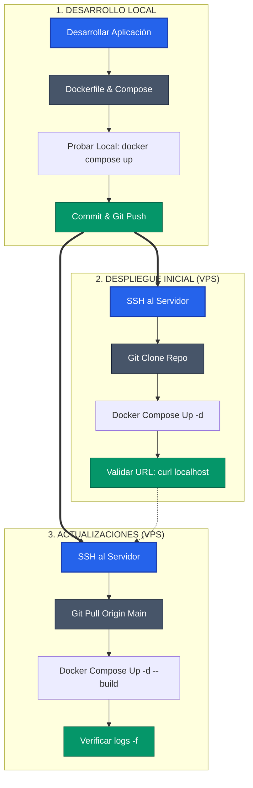

# Guía de Despliegue en Servidores Linux

Guía práctica para desplegar aplicaciones en los servidores proporcionados para el proyecto.

---

## Tabla de Contenidos

1. [Infraestructura Proporcionada](#infraestructura-proporcionada)
2. [Conexión al Servidor](#conexión-al-servidor)
3. [Transferencia de Archivos](#transferencia-de-archivos)
4. [Control de Versiones con Git](#control-de-versiones-con-git)
5. [Despliegue con Docker](#despliegue-con-docker)
6. [Validación del Despliegue](#validación-del-despliegue)
7. [Integración con VS Code](#integración-con-vs-code)
8. [Comandos de Referencia Rápida](#comandos-de-referencia-rápida)

---

## Infraestructura Proporcionada

Cada equipo dispone de una **máquina virtual Linux** (Ubuntu Server) dedicada para desplegar su aplicación. Las credenciales de acceso (IP, usuario y contraseña) se encuentran en el **enunciado de vuestro proyecto**.

### Características del servidor

| Aspecto | Detalle |
|---------|---------|
| Sistema Operativo | Ubuntu Server 22.04 LTS |
| Acceso | SSH con usuario y contraseña |
| Permisos | Usuario con privilegios **root** (sudo) |
| Docker | Ya instalado y configurado |
| Directorio de trabajo | Tu home (`/home/tu-usuario/`) |

### ¿Qué significa esto?

- **Tenéis control total**: vuestro usuario tiene permisos de administrador (root), lo que os permite instalar software, modificar configuraciones del sistema y gestionar servicios.
- **Docker listo para usar**: no necesitáis instalar nada adicional para ejecutar contenedores.
- **Espacio propio**: podéis trabajar en vuestro directorio home (`~`) o crear carpetas donde necesitéis.
- **Máquinas idénticas**: todas las VMs tienen la misma configuración base, así que los comandos y procedimientos de esta guía funcionarán igual para todos los equipos.

### Antes de empezar

Asegúrate de tener en tu máquina local:
- **Terminal**: Linux/Mac ya lo tienen. En Windows usa PowerShell, CMD o WSL.
- **Git**: para gestionar tu código ([descargar](https://git-scm.com/downloads)).
- **VS Code** (opcional): con la extensión Remote-SSH para editar directamente en el servidor.

---

## Conexión al Servidor

### ¿Qué es SSH?

**SSH (Secure Shell)** es el protocolo estándar para conectarse a servidores de forma segura. Permite abrir una terminal remota en el servidor como si estuvieras sentado frente a él, pero desde tu ordenador local. Toda la comunicación va cifrada, así que tus credenciales y comandos están protegidos.

Cuando te conectas por SSH, verás el prompt del servidor (algo como `usuario@servidor:~$`) y podrás ejecutar comandos como si fuera tu propia terminal.

### Conexión básica

Abre una terminal en tu máquina local y ejecuta:

```bash
ssh tu-usuario@ip-del-servidor
```

**Ejemplo** (sustituye por los datos de tu enunciado):

```bash
ssh equipo01@10.0.0.50
```

El sistema te pedirá la contraseña. Al escribirla **no verás los caracteres** (ni asteriscos), pero se está registrando. Pulsa Enter cuando termines.

Si todo va bien, verás algo como:

```
Welcome to Ubuntu 22.04 LTS
equipo01@vm-proyecto:~$
```

¡Ya estás dentro! Ahora cualquier comando que escribas se ejecutará en el servidor.

### Cerrar la conexión

Para salir del servidor y volver a tu terminal local:

```bash
exit
```

O simplemente cierra la ventana de terminal.

### Conexión con clave SSH (opcional, más cómodo)

Si te cansas de escribir la contraseña cada vez, puedes configurar autenticación por clave SSH:

1. **Generar clave SSH** (en tu máquina local, solo una vez):

```bash
ssh-keygen -t ed25519 -C "tu-email@ejemplo.com"
```

Esto crea dos archivos en `~/.ssh/`: una clave privada (guárdala segura) y una pública (`.pub`).

2. **Copiar clave pública al servidor**:

```bash
ssh-copy-id tu-usuario@ip-del-servidor
```

Te pedirá la contraseña una última vez.

3. **Conectar sin contraseña**:

```bash
ssh tu-usuario@ip-del-servidor
```

A partir de ahora, entrarás directamente sin que te pida la contraseña.

### Crear un alias para conectar más rápido (opcional)

Si quieres escribir `ssh proyecto` en lugar de `ssh equipo01@10.0.0.50`, crea o edita el archivo `~/.ssh/config`:

```bash
# ~/.ssh/config
Host proyecto
    HostName 10.0.0.50
    User equipo01
    Port 22
```

Ahora puedes conectar simplemente con:

```bash
ssh proyecto
```

---

## Transferencia de Archivos

A veces necesitas copiar archivos entre tu ordenador y el servidor: subir tu código, descargar logs, etc. Hay varias formas de hacerlo.

### SCP (Secure Copy) - Rápido y directo

SCP es el comando más simple para copiar archivos. Funciona como `cp` pero entre máquinas.

**Subir un archivo al servidor:**

```bash
scp archivo.txt tu-usuario@ip-servidor:~/
```

Esto copia `archivo.txt` a tu home en el servidor (`~` es tu carpeta personal).

**Subir una carpeta completa:**

```bash
scp -r mi-proyecto/ tu-usuario@ip-servidor:~/
```

El `-r` significa "recursivo" (incluye subcarpetas).

**Descargar un archivo del servidor a tu máquina:**

```bash
scp tu-usuario@ip-servidor:~/logs/error.log ./
```

**Ejemplos prácticos:**

```bash
# Subir tu app al home del servidor
scp -r ./mi-app/ equipo01@10.0.0.50:~/mi-app/

# Descargar un backup
scp equipo01@10.0.0.50:~/backups/db.sql ./descargas/
```

### SFTP - Modo interactivo (como un explorador de archivos en terminal)

SFTP te da una sesión interactiva donde puedes navegar, listar y transferir archivos paso a paso. Útil cuando no sabes exactamente qué archivos necesitas.

```bash
# Conectar
sftp tu-usuario@ip-servidor
```

Una vez dentro, tienes dos "lados": el servidor (comandos normales) y tu máquina local (comandos con `l` delante):

```bash
sftp> pwd                    # ¿Dónde estoy en el servidor?
sftp> lpwd                   # ¿Dónde estoy en mi máquina local?
sftp> ls                     # Listar archivos del servidor
sftp> lls                    # Listar archivos de mi máquina
sftp> cd proyectos           # Ir a carpeta en servidor
sftp> lcd ~/Descargas        # Ir a carpeta en mi máquina

sftp> put archivo.txt        # Subir archivo al servidor
sftp> put -r carpeta/        # Subir carpeta completa
sftp> get config.json        # Descargar archivo del servidor
sftp> get -r logs/           # Descargar carpeta completa

sftp> exit                   # Salir
```

### Rsync - Para proyectos grandes o sincronización continua

Rsync es más inteligente: solo transfiere los archivos que han cambiado. Ideal para proyectos grandes o cuando actualizas frecuentemente.

```bash
# Sincronizar tu proyecto local con el servidor
rsync -avz --progress ./mi-app/ tu-usuario@ip-servidor:~/mi-app/

# Opciones:
# -a: preserva permisos, fechas, estructura
# -v: muestra lo que está haciendo
# -z: comprime durante la transferencia (más rápido)
# --progress: muestra barra de progreso
```

**Ejemplo de actualización:**

```bash
# Primera vez: sube todo
rsync -avz ./mi-app/ equipo01@10.0.0.50:~/mi-app/

# Siguiente vez: solo sube los cambios (mucho más rápido)
rsync -avz ./mi-app/ equipo01@10.0.0.50:~/mi-app/
```

**Simular antes de ejecutar:**

```bash
rsync -avz --dry-run ./mi-app/ equipo01@10.0.0.50:~/mi-app/
```

El `--dry-run` te dice qué haría sin hacer nada. Útil para verificar antes de ejecutar.

---

## Control de Versiones con Git

Git te permite versionar tu código y sincronizarlo entre tu máquina y el servidor de forma ordenada. **Es la forma recomendada de mover código al servidor**, mucho más limpio que copiar archivos manualmente.

### ¿Por qué usar Git para desplegar?

- **Historial**: puedes volver atrás si algo sale mal
- **Sincronización**: un `git pull` actualiza todo en segundos
- **Colaboración**: todos los del equipo trabajan sobre el mismo código
- **Trazabilidad**: sabes exactamente qué versión está desplegada

### Flujo de Trabajo Recomendado

#### 1. Prepara tu código en local y súbelo a GitHub/GitLab

Desde tu máquina de desarrollo:

```bash
# Entrar a tu proyecto
cd mi-aplicacion

# Inicializar Git (solo la primera vez)
git init

# Agregar todos los archivos
git add .

# Crear el primer commit
git commit -m "feat: versión inicial de la aplicación"

# Conectar con tu repositorio remoto (GitHub, GitLab, etc.)
git remote add origin https://github.com/tu-usuario/mi-aplicacion.git

# Subir el código
git push -u origin main
```

#### 2. Clona el repositorio en el servidor

Conéctate al servidor y descarga tu código:

```bash
# Conectar al servidor
ssh tu-usuario@ip-servidor

# Ir a tu home (o donde quieras trabajar)
cd ~

# Clonar tu repositorio
git clone https://github.com/tu-usuario/mi-aplicacion.git

# Entrar al proyecto
cd mi-aplicacion
```

Ahora tienes tu código en el servidor, listo para ejecutar.

#### 3. Actualizar la aplicación (cuando hagas cambios)

Cada vez que subas cambios a GitHub desde tu máquina local, actualiza el servidor con:

```bash
# En el servidor, dentro de la carpeta del proyecto
cd ~/mi-aplicacion
git pull origin main
```

Esto descarga solo los cambios nuevos, muy rápido.

### Ejemplo Completo: Probar con un Repositorio de Ejemplo

Si quieres practicar antes de usar tu propio código:

```bash
# En el servidor
cd ~

# Clonar una app de ejemplo de Docker
git clone https://github.com/docker/welcome-to-docker.git

# Entrar y explorar
cd welcome-to-docker
ls -la
```

### Comandos Git Esenciales

| Comando | Qué hace |
|---------|----------|
| `git clone URL` | Descarga un repositorio por primera vez |
| `git pull` | Actualiza con los últimos cambios |
| `git status` | Ver qué archivos han cambiado |
| `git log --oneline -5` | Ver los últimos 5 commits |
| `git diff` | Ver qué ha cambiado en detalle |

---

## Despliegue con Docker

### ¿Qué es Docker y por qué usarlo?

**Docker** permite empaquetar tu aplicación junto con todo lo que necesita para funcionar (librerías, dependencias, configuración) en una "caja" aislada llamada **contenedor**. 

**Ventajas:**
- **"En mi máquina funciona"** → Si funciona en Docker local, funciona en el servidor
- **Aislamiento**: tu app no interfiere con otras del sistema
- **Reproducibilidad**: mismo entorno siempre
- **Fácil de actualizar**: parar contenedor viejo, arrancar nuevo

### Conceptos Básicos (los 4 que necesitas conocer)

| Concepto | Qué es | Analogía |
|----------|--------|----------|
| **Imagen** | Plantilla con tu app y todo lo que necesita | Como una ISO o snapshot |
| **Contenedor** | Una imagen ejecutándose | Como una VM pero más ligera |
| **Dockerfile** | Receta para crear una imagen | Como un script de instalación |
| **docker-compose** | Archivo para definir múltiples contenedores | Como un docker run pero ordenado |

### Dockerfile Básico

Ejemplo para una aplicación Node.js:

```dockerfile
# Dockerfile
FROM node:20-alpine

WORKDIR /app

# Copiar dependencias
COPY package*.json ./
RUN npm ci --only=production

# Copiar código
COPY . .

# Exponer puerto
EXPOSE 3000

# Comando de inicio
CMD ["node", "server.js"]
```

Ejemplo para una aplicación Python:

```dockerfile
# Dockerfile
FROM python:3.12-slim

WORKDIR /app

COPY requirements.txt .
RUN pip install --no-cache-dir -r requirements.txt

COPY . .

EXPOSE 8000

CMD ["python", "app.py"]
```

### Construir y Ejecutar

```bash
# Construir imagen
docker build -t mi-aplicacion:v1 .

# Ejecutar contenedor
docker run -d \
  --name mi-app \
  -p 8080:3000 \
  --restart unless-stopped \
  mi-aplicacion:v1

# Opciones:
# -d: ejecutar en background
# --name: nombre del contenedor
# -p 8080:3000: mapear puerto 8080 (host) al 3000 (contenedor)
# --restart: política de reinicio automático
```

### Docker Compose (Recomendado)

Para aplicaciones con múltiples servicios o configuración compleja:

```yaml
# docker-compose.yml
version: '3.8'

services:
  app:
    build: .
    ports:
      - "8080:3000"
    environment:
      - NODE_ENV=production
      - DATABASE_URL=postgres://db:5432/myapp
    depends_on:
      - db
    restart: unless-stopped

  db:
    image: postgres:16-alpine
    volumes:
      - postgres_data:/var/lib/postgresql/data
    environment:
      - POSTGRES_DB=myapp
      - POSTGRES_USER=admin
      - POSTGRES_PASSWORD=secreto
    restart: unless-stopped

volumes:
  postgres_data:
```

```bash
# Iniciar servicios
docker compose up -d

# Ver logs
docker compose logs -f

# Detener servicios
docker compose down

# Reconstruir y reiniciar
docker compose up -d --build
```

### Comandos Docker Esenciales

```bash
# Ver contenedores en ejecución
docker ps

# Ver todos los contenedores
docker ps -a

# Ver logs de un contenedor
docker logs -f nombre-contenedor

# Entrar a un contenedor
docker exec -it nombre-contenedor /bin/sh

# Detener contenedor
docker stop nombre-contenedor

# Eliminar contenedor
docker rm nombre-contenedor

# Ver imágenes
docker images

# Eliminar imagen
docker rmi nombre-imagen

# Limpiar recursos no utilizados
docker system prune -a
```

---

## Validación del Despliegue

### 1. Verificar que el contenedor está corriendo

```bash
docker ps
# Debe mostrar tu contenedor con STATUS "Up"
```

### 2. Revisar logs

```bash
docker logs mi-app
# Buscar errores de inicio o conexión
```

### 3. Probar conectividad local (desde el servidor)

```bash
curl http://localhost:8080
# Debe devolver respuesta de tu aplicación
```

### 4. Probar conectividad externa

```bash
# Desde tu máquina local
curl http://ip-del-servidor:8080

# O abre en navegador
# http://ip-del-servidor:8080
```

### 5. Verificar puertos abiertos

```bash
# En el servidor
ss -tlnp | grep 8080
# o
netstat -tlnp | grep 8080
```

### 6. Verificar firewall (si aplica)

```bash
# Ver reglas activas
sudo ufw status

# Permitir puerto si es necesario
sudo ufw allow 8080/tcp
```

### Troubleshooting Común

| Problema | Causa Probable | Solución |
|----------|----------------|----------|
| Contenedor se reinicia constantemente | Error en aplicación | `docker logs mi-app` |
| Puerto no accesible externamente | Firewall bloqueando | `sudo ufw allow PUERTO` |
| "Address already in use" | Puerto ocupado | `docker ps` o `ss -tlnp` |
| Cambios no reflejados | Imagen no reconstruida | `docker compose up -d --build` |

---

## Integración con VS Code

VS Code tiene una extensión llamada **Remote - SSH** que te permite **abrir carpetas del servidor directamente en tu editor**, como si fueran locales. Puedes editar archivos, usar el terminal integrado, y todo se sincroniza automáticamente. Es la forma más cómoda de trabajar.

### Instalación de la extensión

1. Abre VS Code en tu ordenador
2. Ve a **Extensions** (Ctrl+Shift+X o el icono de cuadrados en la barra lateral)
3. Busca **"Remote - SSH"**
4. Instala la extensión de Microsoft (la que tiene millones de descargas)

### Configurar la conexión

1. Pulsa **Ctrl+Shift+P** (abre la paleta de comandos)
2. Escribe **"Remote-SSH: Open SSH Configuration File"** y selecciónalo
3. Elige el archivo `~/.ssh/config`
4. Añade la configuración de tu servidor:

```
Host proyecto
    HostName 10.0.0.50
    User equipo01
    Port 22
```

Sustituye `10.0.0.50` y `equipo01` por los datos de tu enunciado.

### Conectar al servidor

1. Pulsa **Ctrl+Shift+P**
2. Escribe **"Remote-SSH: Connect to Host"**
3. Selecciona **"proyecto"** (el nombre que pusiste en Host)
4. VS Code abrirá una nueva ventana y se conectará
5. La primera vez tardará un poco (instala componentes en el servidor)
6. Ve a **File → Open Folder** y selecciona `~/mi-proyecto` (o la carpeta que quieras)

### ¿Qué puedes hacer una vez conectado?

- **Editar archivos** del servidor directamente (se guardan automáticamente en remoto)
- **Terminal integrada** (Ctrl+`) ya conectada al servidor
- **Explorador de archivos** del servidor en la barra lateral
- **Git integrado** funciona con los repos del servidor
- **Extensiones** (linters, formateadores) se ejecutan en el servidor

### Indicador de conexión

Sabrás que estás conectado porque en la esquina inferior izquierda de VS Code verás:

```
SSH: proyecto
```

En verde. Si ves tu máquina local, no estás conectado al servidor.

---

## Comandos de Referencia Rápida

### SSH y Conexión

```bash
ssh tu-usuario@ip-servidor             # Conectar con usuario y contraseña
ssh proyecto                            # Conectar usando alias (si configuraste ~/.ssh/config)
exit                                    # Desconectar del servidor
```

### Transferencia de Archivos

```bash
# SCP - copiar archivos
scp archivo.txt tu-usuario@ip:~/       # Subir archivo al home
scp -r carpeta/ tu-usuario@ip:~/       # Subir carpeta al home
scp tu-usuario@ip:~/log.txt ./         # Descargar archivo

# Rsync - sincronizar (más eficiente para proyectos)
rsync -avz ./mi-app/ tu-usuario@ip:~/mi-app/
```

### Git

```bash
git clone URL                           # Descargar repositorio
git pull                                # Actualizar con últimos cambios
git status                              # Ver estado
git log --oneline -5                    # Ver últimos 5 commits
git add . && git commit -m "mensaje"   # Guardar cambios
git push                                # Subir a GitHub/GitLab
```

### Docker

```bash
docker ps                               # Ver contenedores ejecutándose
docker ps -a                            # Ver TODOS los contenedores
docker logs -f CONTENEDOR              # Ver logs en tiempo real
docker logs --tail 100 CONTENEDOR      # Ver últimas 100 líneas de log
docker exec -it CONTENEDOR /bin/sh     # Entrar dentro de un contenedor
docker stop CONTENEDOR                  # Parar contenedor
docker rm CONTENEDOR                    # Eliminar contenedor
docker images                           # Ver imágenes descargadas
docker system prune -a                  # Limpiar todo lo no usado (¡cuidado!)
```

### Docker Compose

```bash
docker compose up -d                    # Arrancar servicios (en background)
docker compose down                     # Parar y eliminar servicios
docker compose up -d --build           # Reconstruir imagen y arrancar
docker compose logs -f                  # Ver logs de todos los servicios
docker compose ps                       # Ver estado de servicios
docker compose restart                  # Reiniciar servicios
```

### Diagnóstico del Servidor

```bash
curl http://localhost:PUERTO           # Probar que el servicio responde
ss -tlnp                                # Ver qué puertos están abiertos
sudo ufw status                         # Ver reglas del firewall
sudo ufw allow PUERTO/tcp              # Abrir un puerto en el firewall
df -h                                   # Ver espacio en disco
free -h                                 # Ver memoria RAM disponible
top                                     # Ver procesos y uso de recursos
```

---

## Flujo de Despliegue Típico



### Resumen: Comandos de un despliegue típico

```bash
# Desde tu máquina local - subir cambios
git add . && git commit -m "feat: nueva funcionalidad" && git push

# En el servidor - actualizar y redesplegar
ssh tu-usuario@ip-servidor
cd ~/mi-proyecto
git pull
docker compose up -d --build
docker compose logs -f
```

---

## Recursos Adicionales

- [Documentación oficial de Docker](https://docs.docker.com/)
- [Guía SSH de GitHub](https://docs.github.com/en/authentication/connecting-to-github-with-ssh)
- [VS Code Remote Development](https://code.visualstudio.com/docs/remote/ssh)
